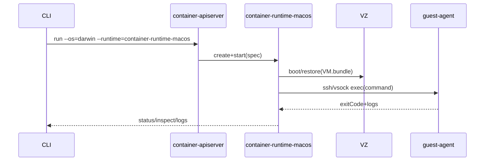
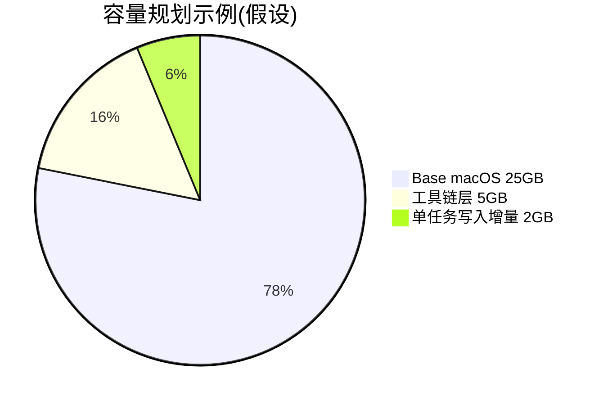

# 基于 Apple/container 的 macOS Guest 运行时可行实现方案

## 执行摘要
在 **apple/container** 的“每容器一 VM”模型下增加一个新的运行时处理器 `container-runtime-macos`，即可把“容器”语义扩展到“完整 macOS VM（guest）”：CLI 仍通过 XPC 访问 `container-apiserver`，由其按容器实例启动对应运行时 helper；macOS guest 由 Virtualization.framework 启动，磁盘用 APFS clonefile 实现秒级复制+写时复制（CoW）差分；命令注入通过 guest 内置 LaunchDaemon/SSH/vsock agent 执行；快照用 `saveMachineState/restoreMachineState` 做“热恢复”以缩短启动时间。该方案工程上可行，但必须接受：macOS SLA 允许的虚拟化实例数/用途限制，以及 Virtualization 框架可能直接返回“虚拟机数量上限”错误；并且镜像分发需避免直接传播 Apple OS 介质。citeturn3view0turn9view0turn11search0turn10search8turn16view0

## 目标与前提假设
目标：在不推翻现有架构前提下，让 `container run` 能运行 `os=darwin` 的镜像，启动完整 macOS guest，并支持 create/start/exec/logs/stop/rm/snapshot。citeturn3view0turn9view0  
前提假设：宿主机为 Apple silicon（未指定型号）；宿主系统为 macOS 26（因为 container 依赖该版本的虚拟化/网络增强）；guest 版本（未指定）；是否需要 GUI（未指定，MVP 默认 headless）；并发上限遵循 macOS SLA “最多两份额外实例”及用途约束（并可能被系统强制）。citeturn3view1turn16view0turn13search3  
假设：允许在 guest 模板里预置一个最小“执行代理”（LaunchDaemon + SSH key 或 vsock 服务），否则 Virtualization.framework 不提供“直接在 guest 内执行命令”的通道。citeturn20view0

## 架构、模块与接口
复用 container 现有“CLI→apiserver→XPC helpers”组织：`container` CLI 通过客户端库与 `container-apiserver` 通信；apiserver 启动 `container-core-images`（镜像/内容存储）、`container-network-vmnet`（网络），并为每个容器启动专属运行时 helper。新增 `container-runtime-macos` 与 `container-runtime-linux` 并列，作为 `--runtime` 的可选值（默认仍 linux）。citeturn3view0turn9view0  

模块划分（SwiftPM）与最小接口（示例）：
```swift
public struct MacOSContainerSpec: Codable {
  public var imageRef: String
  public var cpus: Int; public var memoryMiB: Int
  public var diskGiB: Int
  public var network: NetworkSpec
  public var command: [String]
  public var snapshotPolicy: SnapshotPolicy
}
public protocol MacOSRuntime { // XPC exported
  func create(_ spec: MacOSContainerSpec) async throws -> String // containerID
  func start(_ id: String) async throws
  func exec(_ id: String, _ req: ExecRequest) async throws -> ExecResult
  func stop(_ id: String, timeoutSec: Int) async throws
  func delete(_ id: String) async throws
}
```
数据目录/对象：`VM.bundle`（模板/实例）、`Disk.img`、`AuxiliaryStorage`、`HardwareModel`、`MachineIdentifier`、`SaveFile.vzvmsave`；该 bundle 结构与 Apple 的 macOS VM 示例一致（安装工具生成上述文件）。citeturn20view0turn3view0  

## 核心流程与算法
镜像构建：新增 `container macos prepare-base`（或扩展 `image build`）流程：下载/指定 `.ipsw`→用 `VZMacOSInstaller` 安装→产出“基础 VM.bundle”（Disk/Aux/HardwareModel）。示例项目展示了从 `.ipsw` 安装并观察进度、以及 `validateSaveRestoreSupport`。citeturn20view0  
差分克隆：实例创建时对模板 `Disk.img` 调用 `clonefile()`（同 APFS 卷内近乎瞬时、写时复制）；若目标 FS 不支持 clone，降级为完整拷贝并提示资源开销。APFS 官方指南说明其使用 copy‑on‑write 与 clone files 降低重复存储。citeturn10search8turn10search11  
VM 配置：从模板读取 `HardwareModel`，为每实例生成新 `MachineIdentifier`，复制/克隆 `AuxiliaryStorage`；按 `spec.cpus/memory` 构建 `VZVirtualMachineConfiguration` 并挂载 `Disk.img` 与网络设备（复用 vmnet helper 的子网/IP/端口发布）。citeturn20view0turn3view0turn9view0  
命令注入：MVP 采用 SSH：模板内预置用户与公钥；运行时启动 VM→轮询 SSH 就绪→执行 `spec.command`→采集 stdout/stderr→返回退出码。实践上，Tart/CI 场景常通过“挂载宿主目录”规避 VM 磁盘 CoW 膨胀、提升写入性能（可作为后续优化：virtiofs 共享 `/work`）。citeturn10search9turn11search32turn0search12  
快照恢复：在 macOS 14+ 可用“暂停→saveMachineState→下次 restoreMachineState 恢复而非冷启动”；Apple WWDC23 指出保存文件包含完整运行时状态、需要保护且为硬件加密（跨 Mac/用户不可读），并在不兼容时返回明确错误码以回退冷启动。citeturn11search0turn20view0  
清理：容器结束后按 `--rm` 删除实例 bundle；镜像/模板按 `image prune`/`system df` 逻辑回收。注意 Virtualization 的内存气球支持不完全，进程释放给 guest 的页可能不归还宿主，需通过重启 VM/实例回收。citeturn9view0turn3view0  



## 镜像格式与容量模型
推荐“模板 bundle（本地 CoW）+ OCI 分发（远端）”双形态：本地存储用 raw `Disk.img` + APFS clone 做实例分叉；远端用 OCI registry 存 VM blobs（Tart 已证明“VM 像容器镜像一样 push/pull”在 CI 中可行）。citeturn10search1turn11search24turn0search12turn20view0  

格式对比（简表）：

| 方案 | 本地启动/克隆 | 远端分发 | 复杂度 | 备注 |
|---|---|---|---|---|
| raw(Disk.img) | 中（全拷贝） | 可（大文件） | 低 | 最接近 Apple 示例 bundle citeturn20view0 |
| qcow2 | 快（差分） | 可 | 中-高 | VZ 不原生；需自研块设备/转换（假设） |
| APFS clone(raw) | **最快**（clonefile） | 需配合 OCI | 中 | APFS clone files 基于 CoW 节省空间 citeturn10search8turn10search11 |
| OCI blob(压缩层) | 取决于落盘方式 | **最佳** | 中 | Tart 使用 OCI；但本地仍需 CoW 才“像容器”citeturn10search1turn0search12 |

容量/时间估算（假设）：  
冷启动 `T≈Tboot(macos)+TsshReady`；热恢复 `T≈Trestore+Tresume`（WWDC23 明确 restore 规避冷启动）。citeturn11search0  
磁盘 `D≈Dbase + N*Ddelta`，其中 `Dbase` 可参考 Tart “一次下载约 25GB”级别；`Ddelta` 由 CoW 写入与工具链决定。citeturn11search32turn10search8  



## 交互契约、错误、安全与验收
CLI/守护进程契约：沿用现有 `container run/create/start/exec/logs/inspect` 输出与 JSON/table 格式；通过 `--os darwin`（新增允许值）与 `--runtime container-runtime-macos` 选择运行时；系统服务仍由 `container system start/stop` 管理 `container-apiserver` 与 helpers。citeturn9view0turn3view0  
错误处理与重试：网络/SSH 就绪可指数退避重试；安装/HardwareModel 不支持、VM 数量上限（`virtualMachineLimitExceeded`）不重试，直接回报可操作建议（减少并发/换宿主）。citeturn13search3turn20view0  
权限/签名：Containerization 工具链以 `com.apple.security.virtualization` entitlement codesign；新增运行时与安装工具同样需要该 entitlement（以及若复用既有 XPC 路由，可能涉及 Mach service 访问控制）。citeturn19view0turn17view0turn3view0  
测试与验收：用例覆盖“安装生成模板 bundle→clone 创建实例→run 执行命令并返回退出码→exec 二次命令→端口发布/出网→save/restore 提速→--rm 清理与 system df 回收→压力下内存不回收时可通过重启实例释放”。citeturn9view0turn11search0turn3view0  
部署运维注意：macOS VM 并发与用途受 SLA 约束：允许“最多两份额外实例”，且禁止 service bureau/time‑sharing/terminal sharing 等；若用于 CI 租赁类场景需遵循许可条款与通知要求（SLA 第 2B(iii)/相关限制）。citeturn16view0turn16view1  

实现步骤与里程碑（MVP 优先）：PoC 用示例 VM.bundle 启动并 headless；接入 `container-runtime-macos`（create/start/stop/rm）；加入 SSH 注入与 logs；接入 APFS clonefile；实现 save/restore；最后做 OCI 打包/推送（先内部私有 registry，避免传播 Apple OS 介质）。citeturn20view0turn3view0turn10search1turn16view0  

主要来源：apple/container 技术概览与 CLI 参考；Containerization 签名/entitlement；Apple WWDC23 虚拟机保存恢复；Apple macOS Tahoe SLA；Tart/Anka 文档与实践说明。citeturn3view0turn9view0turn19view0turn11search0turn16view0turn0search12turn10search6