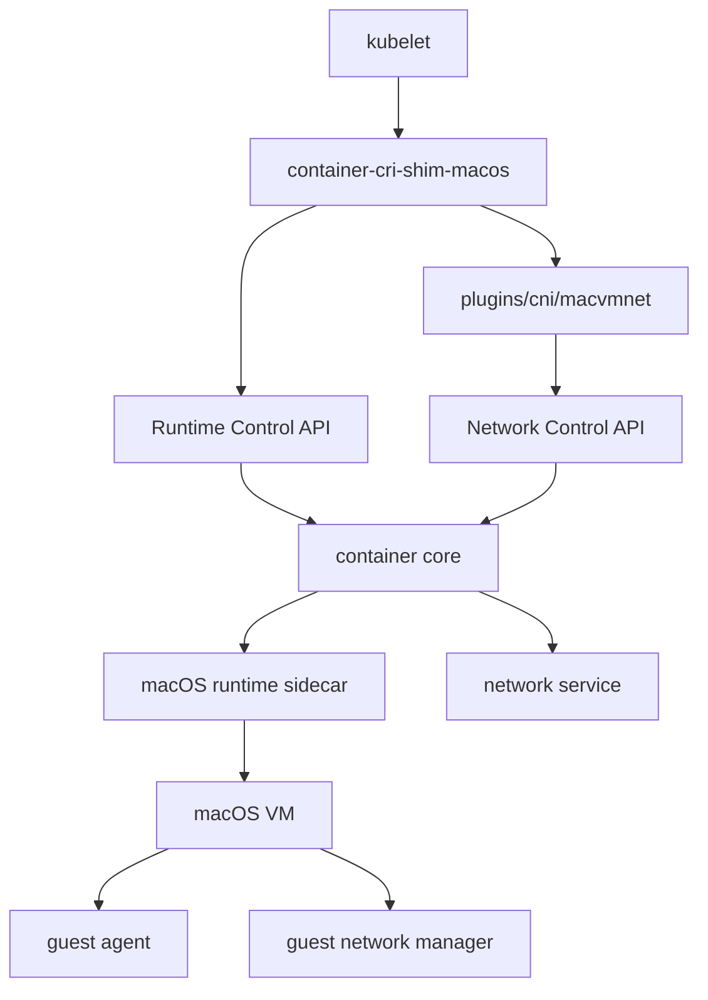

# macOS Guest Kubernetes CRI/CNI Integration Reference

Implementation reference for integrating the macOS guest runtime in `container core`
with Kubernetes `CRI` and `CNI`.

Related design docs:

- [`macos-guest-core-design.md`](./macos-guest-core-design.md)
- [`macos-guest-networking-design.md`](./macos-guest-networking-design.md)
- [`macos-guest-networkpolicy-design.md`](./macos-guest-networkpolicy-design.md)
- [`macos-guest-workload-image-design.md`](./macos-guest-workload-image-design.md)
- [`macos-guest-core-todo.md`](./macos-guest-core-todo.md)

## 1. Solution Summary

- `PodSandbox = Sandbox = macOS VM`
- `Pod network = sandbox network identity`
- each Pod container maps to one workload inside the sandbox
- `container core` provides sandbox/workload lifecycle, workload image injection,
  guest networking, logs, exec, attach, port-forward, and stable control APIs
- Kubernetes integration is provided by:
  - `container-cri-shim-macos`
  - `plugins/cni/macvmnet`
- the first integrated system is:
  - single node
  - single NIC
  - single network
  - IPv4-first

## 2. Current Foundation in `container core`

| Area | Status | Notes |
| --- | --- | --- |
| Sandbox networking | complete | `virtualizationNAT` and `vmnetShared`, guest network bring-up, persisted network lease, network recovery, network control API |
| Sandbox/workload runtime | complete | first-class sandbox and workload resources, split lifecycles, multi-workload execution in one sandbox |
| Workload image model | complete | sandbox image vs workload image, OCI-backed workload payloads, injection, restart recovery |
| Build split | complete | `sandbox build` and `workload build` with explicit payload boundary |
| Runtime control surface | complete | sandbox/workload lifecycle APIs, `ExecSync`, `StreamExec`, `StreamAttach`, `StreamPortForward`, stable inspect snapshots |
| Logging and events | complete | per-workload stdout/stderr and sandbox event log |
| CRI shim | planned | external adapter layer |
| CNI plugin | planned | external adapter layer |
| Single-node kubelet validation | planned | end-to-end integration |
| Later expansion | planned | `HostPort`, IPv6, multi-network, `NetworkPolicy`, stronger isolation, metrics |

## 3. Architecture

### 3.1 Component Layout

| Component | Responsibility |
| --- | --- |
| `kubelet` | drives Pod lifecycle through CRI |
| `container-cri-shim-macos` | exposes CRI gRPC, translates Kubernetes objects into core sandbox/workload operations, invokes the CNI plugin |
| `plugins/cni/macvmnet` | handles `ADD` / `DEL` / `CHECK`, prepares sandbox network state, returns CNI results |
| `container core` | owns sandbox/workload state, guest runtime control, workload image handling, network lifecycle, logs, and streaming operations |
| macOS runtime sidecar | boots the VM, restores prepared network attachments, brokers vsock and guest operations |
| guest agent and guest network manager | apply guest configuration, start workloads, provide streaming and file transfer endpoints |
| network service and allocator | allocate attachment state, IP, MAC, gateway, and DNS projection |

### 3.2 Integration Diagram

## 4. Core Runtime Model

### 4.1 Sandbox

The sandbox is the Pod boundary. It owns:

- VM lifecycle
- network lease
- sidecar lifecycle
- sandbox directories
- shared injected resources
- sandbox event log

### 4.2 Workload

The workload is the Pod container boundary inside the sandbox. It owns:

- workload image reference and resolved digest
- payload rootfs and metadata
- `entrypoint`
- `cmd`
- environment
- user
- working directory
- stdout and stderr logs
- exit status

### 4.3 Image Model

#### Sandbox Image

Sandbox images boot the VM and contain guest base artifacts:

- `Disk.img`
- `AuxiliaryStorage`
- `HardwareModel`

#### Workload Image

Workload images are OCI artifacts with:

- payload filesystem layers
- `entrypoint`
- `cmd`
- environment
- user
- working directory
- explicit image role metadata

Guest injection layout:

- `/var/lib/container/workloads/<id>/rootfs`
- `/var/lib/container/workloads/<id>/meta.json`

## 5. Core Control Surfaces

### 5.1 Runtime Control API

- `CreateSandbox`
- `StartSandbox`
- `StopSandbox`
- `RemoveSandbox`
- `CreateWorkload`
- `StartWorkload`
- `StopWorkload`
- `RemoveWorkload`
- `InspectSandbox`
- `InspectWorkload`
- `ExecSync`
- `StreamExec`
- `StreamAttach`
- `StreamPortForward`

### 5.2 Network Control API

- `PrepareSandboxNetwork`
- `InspectSandboxNetwork`
- `ReleaseSandboxNetwork`

`PrepareSandboxNetwork` allocates or restores the persisted sandbox network lease and
returns the attachment state. `InspectSandboxNetwork` returns the current sandbox
network snapshot. `ReleaseSandboxNetwork` releases the lease and host-side
allocations.

### 5.3 Observable State

Core state exposed to the integration layer includes:

- sandbox snapshot
- workload snapshot
- sandbox network attachments
- IP
- gateway
- DNS
- MAC
- network ID
- per-workload stdout/stderr log location
- sandbox event log

## 6. Network Model

### 6.1 Backend Selection

- `virtualizationNAT`
  - compatibility path
  - image-build path
- `vmnetShared`
  - sandbox runtime path
  - host-visible sandbox networking

### 6.2 Sandbox Network State

The persisted sandbox network lease stores:

- backend
- `networkID`
- MAC
- IPv4 and prefix
- gateway
- DNS projection

The sidecar recreates `VZVmnetNetworkDeviceAttachment` instances from the persisted
lease during bootstrap or recovery. The guest network manager applies the same lease
inside the guest.

### 6.3 Initial Kubernetes Networking Scope

- single node
- single NIC
- single network
- IPv4-first
- same-node Pod connectivity
- external egress
- DNS projection into the guest

Later networking extensions:

- `HostPort`
- IPv6
- multiple network attachments
- multi-node and overlay networking
- `NetworkPolicy`

## 7. Kubernetes Integration Layer

### 7.1 CRI Shim

`container-cri-shim-macos` exposes the CRI RuntimeService and ImageService and maps
CRI operations onto core APIs and workload image handling.

#### RuntimeService Mapping

| CRI call | Core operation |
| --- | --- |
| `RunPodSandbox` | `CreateSandbox` -> CNI `ADD` -> `StartSandbox` |
| `StopPodSandbox` | `StopSandbox` |
| `RemovePodSandbox` | `RemoveSandbox` |
| `PodSandboxStatus` | `InspectSandbox` + `InspectSandboxNetwork` |
| `CreateContainer` | `CreateWorkload` |
| `StartContainer` | `StartWorkload` |
| `StopContainer` | `StopWorkload` |
| `RemoveContainer` | `RemoveWorkload` |
| `ContainerStatus` | `InspectWorkload` |
| `ExecSync` | `ExecSync` |
| `Exec` | `StreamExec` |
| `Attach` | `StreamAttach` |
| `PortForward` | `StreamPortForward` |

#### ImageService Mapping

The shim manages:

- workload image pull, inspect, list, remove
- sandbox image selection for Pod boot
- mapping from `RuntimeClass`, node configuration, or sandbox metadata to the chosen
  sandbox image

### 7.2 CNI Plugin

`plugins/cni/macvmnet` implements:

- `ADD`
- `DEL`
- `CHECK`

The plugin operates on an existing sandbox record created by the CRI shim. The
sandbox configuration already contains:

- network attachments
- DNS configuration
- sandbox ID
- hostname

#### CNI Mapping

| CNI command | Core operation | Result |
| --- | --- | --- |
| `ADD` | `PrepareSandboxNetwork` | Pod IP, routes, gateway, DNS, MAC, network ID |
| `CHECK` | `InspectSandboxNetwork` | current Pod network state |
| `DEL` | `ReleaseSandboxNetwork` | release of Pod network allocation |

### 7.3 Pod Lifecycle Sequence

#### Pod startup

1. The CRI shim creates the sandbox record and persists sandbox network requests.
2. The CRI shim invokes `macvmnet` for `ADD`.
3. The CNI plugin calls `PrepareSandboxNetwork`.
4. The CRI shim starts the sandbox.
5. The sidecar restores the prepared lease and creates VM network devices.
6. The guest network manager configures the guest interface from the lease.
7. The CRI shim creates and starts workloads inside the running sandbox.

#### Pod teardown

1. The CRI shim stops workloads and stops the sandbox.
2. The CRI shim invokes `macvmnet` for `DEL`.
3. The CNI plugin calls `ReleaseSandboxNetwork`.
4. The CRI shim removes the sandbox record.

## 8. Logs, Streaming, and Volumes

### 8.1 Logs

The logging model for Kubernetes integration is:

- one stdout log per workload
- one stderr log per workload
- one sandbox event log

The CRI shim surfaces workload log paths or log-reading endpoints from core snapshot
state.

### 8.2 Streaming

Streaming operations are provided directly by core:

- `ExecSync`
- `StreamExec`
- `StreamAttach`
- `StreamPortForward`

`PortForward` uses the sidecar or vsock path and is independent from `HostPort`.

### 8.3 Volumes

Initial Pod volume support maps onto existing sandbox filesystem primitives:

- `emptyDir` -> sandbox-scoped temporary directories
- `hostPath` -> existing host path mappings
- `ConfigMap` / `Secret` -> generic read-only file injection
- `projected` -> composition of injected read-only files

## 9. NetworkPolicy Extension

The `NetworkPolicy` model extends the sandbox network identity.

Policy boundary:

- `1 PodSandbox = 1 Sandbox = 1 macOS VM`
- all workloads in the sandbox share the same policy boundary

Policy data:

- `sandboxID`
- `networkID`
- IP
- MAC
- gateway
- DNS
- `generation`

Policy enforcement model:

- host-side enforcement
- sandbox-scoped ingress and egress ACLs
- selector resolution in the Kubernetes integration layer
- concrete ACL application in core

Policy API extension:

- `ApplySandboxPolicy(sandboxID, generation, ingressACL, egressACL)`
- `RemoveSandboxPolicy(sandboxID)`

Initial `NetworkPolicy` scope:

- node-local
- IPv4
- L3/L4 ingress and egress
- TCP and UDP

## 10. Delivery Stages

| Stage | Status | Result |
| --- | --- | --- |
| Core foundation | complete | sandbox networking, sandbox/workload runtime, workload image model, runtime control API, network control API |
| CRI shim MVP | planned | kubelet-facing RuntimeService and ImageService backed by core APIs |
| CNI plugin MVP | planned | `ADD` / `DEL` / `CHECK` backed by sandbox-scoped network control APIs |
| Single-node kubelet integration | planned | static Pod, single-container Pod, multi-container Pod, probes, logs, exec, port-forward |
| Expansion | planned | `HostPort`, stronger crash recovery, metrics, IPv6, multiple networks, multi-node networking, `NetworkPolicy`, stronger isolation |

## 11. Validation Targets

### 11.1 Core and Network

- sandbox startup with a stable IPv4
- same-node Pod-to-Pod connectivity
- external egress
- restart recovery from persisted network lease
- stable sandbox network inspection

### 11.2 CRI

- `RunPodSandbox`
- `CreateContainer`
- `StartContainer`
- `ExecSync` probes
- `kubectl exec`
- `kubectl logs`
- `kubectl port-forward`

### 11.3 Kubernetes End-to-End

- static Pod
- single-container Pod
- two-container Pod
- HTTP and TCP probes
- exec probe
- Service reachability through Pod IP on a single node
