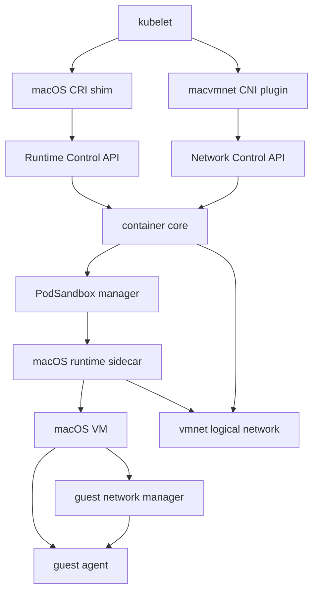
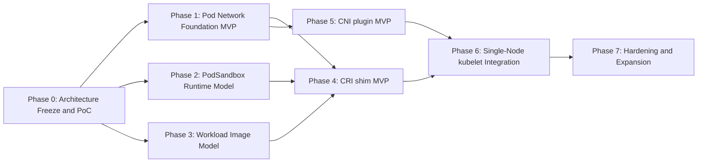

# Engineering Roadmap for Aligning macOS Guest with Kubernetes CRI/CNI

This document is for developers maintaining and extending `container`. The goal is to evolve the current macOS guest path behind `container run --os darwin` into a minimal runtime surface that can satisfy Kubernetes CRI and CNI integration requirements.

The document focuses on implementation strategy rather than Kubernetes basics. It answers:

- what the target architecture should be
- which capabilities are missing
- how each capability should be implemented
- how the dependencies fit together
- what order of execution is most likely to work

## 1. Executive Summary

The recommended target model is:

- `1 PodSandbox = 1 macOS VM`
- `Pod network = VM network`
- multiple containers inside a Pod map to multiple workload processes or services inside the same VM
- `CRI` is integrated through a separate shim instead of exposing the current CLI or XPC APIs directly to kubelet
- phase 1 `CNI` should be a custom main plugin rather than an attempt to reuse Linux-oriented plugins directly
- all Kubernetes-specific logic must live in an external integration layer and must not create reverse dependencies into the standalone `container` project

Why this path:

- the current macOS guest runtime already has VM lifecycle, in-guest process execution, stdio forwarding, vsock `dial`, and file injection, which makes it a reasonable PodSandbox control-plane base
- the current semantics are still `container = VM`, which does not map well onto Kubernetes `PodSandbox + Containers`
- current networking is still based on `Virtualization NAT`, which cannot provide stable Pod IPs, CNI-managed network attachment, or Pod-to-Pod communication on the same node

## 2. Current Implementation State

### 2.1 Existing Capabilities

- `container run --os darwin` can boot a macOS VM and execute commands
- runtime architecture uses `container-runtime-macos`, a GUI-domain sidecar, and guest-agent
- the guest control plane runs over vsock and does not depend on guest IP networking
- guest file transfer exists and can write host files into the guest
- a sandbox can already host multiple process sessions

Relevant code:

- `Sources/Helpers/RuntimeMacOS/MacOSSandboxService.swift`
- `Sources/Helpers/RuntimeMacOSSidecar/RuntimeMacOSSidecar.swift`
- `Sources/Helpers/MacOSGuestAgent/MacOSGuestAgent.swift`
- `docs/macos-guest-technical-design.md`

### 2.2 Current Gaps

- macOS guest networking is fixed to `VZNATNetworkDeviceAttachment`
- `--network`, `--publish`, and `--publish-socket` are disabled for `--os darwin`
- the runtime reports empty `networks` state for darwin sandboxes and containers
- the guest has no standalone networking component
- the resource model is still container-centric rather than PodSandbox-centric
- there is no CRI shim
- there is no CNI plugin
- there is no dual-image model for `sandbox image` and `workload image`

## 3. Target Capability Model

For Kubernetes integration, the work can be grouped into four layers:

1. network foundation
2. PodSandbox runtime
3. workload image and injection model
4. Kubernetes interface layer

### 3.1 Minimal Kubernetes Capability Set

| Capability | Target Semantics | Notes |
| --- | --- | --- |
| PodSandbox lifecycle | create, start, stop, remove VM sandbox | maps to CRI `RunPodSandbox` and related calls |
| Pod IP | every Pod gets a stable reportable IPv4 address | required by CNI `ADD/DEL/CHECK` |
| Pod egress | Pod can reach external networks | minimum usability requirement |
| Same-node Pod connectivity | Pods on the same node can reach each other | prerequisite for Service and probes |
| DNS configuration | Pod receives nameserver, search, and domain configuration | should satisfy common kubelet expectations first |
| Container lifecycle | manage multiple workloads inside the Pod VM | maps to CRI `CreateContainer` and related calls |
| ExecSync | synchronous command execution inside a running workload | often required for probes |
| Exec/Attach | interactive execution and stream attach | required for debugging |
| PortForward | CRI-level port forwarding | higher priority than HostPort |
| Logs | capture and read logs | basic Kubernetes requirement |
| Volumes | at least `emptyDir`, `hostPath`, and ConfigMap/Secret-style injection | should build on existing guest file injection |

### 3.2 Capabilities Deferred from the First Stage

- multi-node overlay networking
- NetworkPolicy
- eBPF, iptables, or tc-style bandwidth and policy plugins
- full Linux-container-grade isolation semantics
- HostPort, NodePort, and LoadBalancer ingress
- IPv6
- multiple network attachments

These are important later, but they should not block the first goal of running a Pod on a single node.

## 4. Target Architecture

### 4.1 Control-Plane Model

Target object model:

- `PodSandbox`
  - maps to one macOS VM
  - owns network, base filesystem, sandbox-level volumes, guest-agent, and Pod-level state
- `WorkloadContainer`
  - maps to one workload running inside that VM
  - owns command, environment, cwd, user, logs, and exit state

The project should introduce new internal abstractions instead of continuing to overload the current "one container means one VM" semantics.

### 4.2 Data-Plane Model

- southbound:
  - VM startup uses `Virtualization.framework`
  - guest control stays on vsock
  - Pod networking attaches through vmnet logical networking
- northbound:
  - kubelet talks to a CRI shim over gRPC
  - a CNI plugin manages Pod network lifecycle through standard `ADD/DEL/CHECK`
  - CRI and CNI call stable internal control APIs rather than CLI implementation details

### 4.3 Decoupling Boundaries

The system should be divided cleanly into two layers:

- `container core`
  - owns VM lifecycle, guest-agent protocol, PodSandbox and workload control, network attachment, file injection, logs, and internal control APIs
  - does not understand `PodSandboxStatusRequest`, CNI JSON, `RuntimeClass`, kubelet config, or similar Kubernetes-specific objects
- `Kubernetes integration`
  - owns the CRI gRPC server, CNI binary, and mapping from Kubernetes objects to core APIs
  - must not edit internal core state files directly, and must not depend on CLI parsing logic

Recommended call paths:

- kubelet -> CRI shim -> `Runtime Control API`
- CNI plugin -> `Network Control API`
- `Runtime Control API` / `Network Control API` -> `container core`

### 4.4 Repository and Delivery Boundaries

The preferred long-term structure is a separate repository:

- this repository continues to host only `container core`
- Kubernetes-specific integration moves into something like `container-k8s`

If the work must start in the same repository during incubation, keep the dependency direction one-way:

- place it under something like `Integrations/Kubernetes/`
- `container core` must not import CRI protobuf, CNI schemas, or kubelet helpers
- default install artifacts must not include the CRI shim or CNI plugin
- `container system start` must not start kubelet-related components
- CRI and CNI should keep their own build, release, and test matrix

### 4.5 Recommended Architecture Diagram

## 5. Key Design Decisions

### 5.1 Kubernetes Integration Must Stay in an External Adapter Layer

This is the most important non-functional constraint in the document.

Rules:

- `container core` must not import CRI protobuf, CNI config models, or kubelet-specific state machines
- the `container` CLI must not gain kubelet-only commands or config formats
- kubelet semantic translation belongs only in the CRI shim
- CNI `Result` handling and `ADD/DEL/CHECK` idempotency belong only in the CNI plugin
- core should expose only generic runtime and network control contracts

If this boundary is violated, two problems follow:

- Kubernetes requirements will start driving the core API design of the standalone `container` project
- the release cadence of `container` will become coupled to kubelet and CNI compatibility issues

### 5.2 PodSandbox Must Map to a VM

Do not try to put multiple Pods into the same macOS VM. That immediately breaks:

- Pod network isolation
- independent Pod lifecycle
- consistency between PodSandbox state and Kubernetes semantics

### 5.3 Workload Containers Must Not Equal VM Images

The design must distinguish two image types:

- `sandbox image`
  - a full macOS base image
  - used to boot the Pod VM
- `workload image`
  - a workload payload injected into the guest
  - used to create and start containers inside the Pod VM

Without this split, the system is stuck at "one container Pod equals one VM" and cannot model multi-container Pods.

### 5.4 Phase 1 Should Not Aim for Linux CNI Data-Plane Compatibility

On a macOS worker, the goal should not be to reuse Linux `bridge`, `portmap`, `bandwidth`, or `firewall` plugins directly. They depend heavily on Linux `netns`, iptables, tc, and eBPF.

The correct phase-1 direction is:

- a custom main plugin
- a standard CNI interface
- explicit control over vmnet and Pod IP allocation

### 5.5 `PortForward` Before `HostPort`

The minimum network ingress feature required for kubelet integration is CRI `PortForward`, not `HostPort`.

Recommended priority:

1. Pod IP reachability
2. `ExecSync`
3. `PortForward`
4. `HostPort`

## 6. Dependency Overview

### 6.1 Critical Gates

There are three technical gates that must be resolved early:

1. whether `VZVmnetNetworkDeviceAttachment` can work with the current vmnet ownership model
2. how static guest-side networking can be applied reliably
3. how the boundary between `sandbox image` and `workload image` is defined

Without clear answers to these three, later CRI and CNI work is likely to be reworked.

There is also one architectural prerequisite:

4. whether `Runtime Control API` and `Network Control API` can be kept small and stable enough

### 6.2 Dependency Graph

### 6.3 Subsystem Dependency Matrix

| Subsystem | Direct Dependencies |
| --- | --- |
| Runtime Control API | core runtime object model, state inspection, exec, log, and port-forward |
| Network Control API | network attachment, IPAM, sandbox network state |
| vmnet attachment rework | `Virtualization.framework`, vmnet helper, sidecar |
| guest network manager | guest-agent install path, Pod network config input |
| PodSandbox manager | network foundation, sidecar lifecycle |
| workload image model | file transfer, image metadata, in-guest startup protocol |
| CRI shim | `Runtime Control API`, PodSandbox manager, workload manager, logs, exec, attach, port-forward |
| CNI plugin | `Network Control API`, IPAM, Pod state inspection |
| kubelet integration | CRI shim, CNI plugin, Pod IP, logs |

### 6.4 Couplings to Avoid

The following must not enter `container core`:

- CRI protobuf definitions
- CNI config schemas and Result objects
- kubelet restart and backoff semantics
- Kubernetes-specific assembly logic for `RuntimeClass`, Pod UID, and sandbox metadata
- CNI binary installation paths and kubelet configuration paths

The following must not leak into the CRI shim or CNI plugin:

- private sidecar or guest-agent frame protocol details
- core state directory layout or persistence file format
- CLI argument parsing logic

## 7. Phased Delivery Plan

### 7.1 Phase 0: Architecture Freeze and PoC

### Goal

- validate the feasible network attachment path
- validate guest-side networking
- freeze the PodSandbox and workload image model
- freeze the boundaries of `Runtime Control API` and `Network Control API`

### Required Capabilities

- `VZVmnetNetworkDeviceAttachment` technical PoC
- guest-side static networking PoC
- PodSandbox object model draft
- workload image draft
- control API boundary draft

### Implementation Direction

#### A. Validate vmnet Attachment Ownership

Current SDK guidance says `VZVmnetNetworkDeviceAttachment` requires the network to be created by the same application process that uses it for the VM. In the current project:

- the network is created by the `container-network-vmnet` helper
- the VM is created by `container-runtime-macos-sidecar`

Three PoCs should be evaluated early:

1. the sidecar creates the vmnet network and attaches it directly
2. the network helper creates the network and serializes it to the sidecar
3. network creation moves into the sidecar, while centralized IPAM and control APIs remain outside

#### B. Validate guest-Side Networking

The current vmnet helper disables DHCP, so the guest must have a controlled network configuration mechanism. The PoC target is:

- locate the target interface by MAC after guest boot
- configure IPv4 address, prefix, default route, and DNS
- re-apply reliably after reboot or restart

It is recommended to introduce an independent `guest network manager` rather than hiding network setup inside the generic exec path.

#### C. Freeze the Image Model

Define:

- `sandbox image` for the VM base
- `workload image` for the injected workload payload

At minimum, clarify:

- the content boundary of the workload image
- how it maps to guest-side file layout
- how multiple containers in one Pod share the same sandbox image

#### D. Freeze the Adapter-Layer APIs

Before any shim or plugin work, define a minimal control surface for the external adapter layer, for example:

- `CreateSandbox`
- `StartSandbox`
- `StopSandbox`
- `RemoveSandbox`
- `CreateWorkload`
- `StartWorkload`
- `StopWorkload`
- `InspectSandbox`
- `InspectWorkload`
- `ExecSync`
- `StreamExec`
- `StreamAttach`
- `StreamPortForward`
- `PrepareSandboxNetwork`
- `InspectSandboxNetwork`
- `ReleaseSandboxNetwork`

The API should:

- avoid CRI- and CNI-specific types
- expose only core-owned abstractions
- be callable separately by the CRI shim and the CNI plugin

### Deliverables

- one architecture decision document
- two PoC programs or experiment branches
- one workload image format draft
- one control API draft

### Acceptance Criteria

- it is clear whether a VM can attach to a centrally controlled vmnet network
- static IPv4 configuration can be applied reliably inside the guest
- `PodSandbox = VM` and `workload != VM image` are fixed
- it is clear which stable control APIs the Kubernetes integration layer should depend on

### Risks

- if the "same process" constraint breaks the current helper and sidecar layering, network ownership must move
- if guest networking depends on unstable interfaces, long-term maintenance cost will be high

### 7.2 Phase 1: Pod Network Foundation MVP

### Goal

Give the macOS PodSandbox a reportable, reclaimable, and mutually reachable Pod IP.

### Scope

- single node
- single NIC
- single network
- IPv4-first
- vmnet shared mode

### Required Capabilities

- mac runtime accepts network attachment input
- the sidecar uses vmnet attachment instead of fixed NAT
- guest network manager configures static networking during sandbox startup
- sandbox state reports real network information
- `Network Control API` is callable from an external CNI plugin

### Implementation Direction

#### A. Runtime Configuration Plumbing

Restore network input on the darwin path, even if phase 1 supports only one attachment:

- `ContainerConfiguration.networks`
- `ContainerConfiguration.dns`
- `SandboxSnapshot.networks`

The darwin path does not need to expose a general-purpose CLI flag immediately, but the internal API must support it.

#### B. Sidecar Network Attachment Abstraction

Replace the hard-coded `createNATDevice()` with a configurable factory:

- `Virtualization NAT`
- `vmnet logical network`

Phase 1 only needs the MVP of the latter.

#### C. guest Network Manager

Add a dedicated LaunchDaemon or guest-agent subservice whose responsibilities are limited to:

- matching the network interface
- configuring IP, prefix, and gateway
- writing DNS, search domains, and domain
- returning success or failure

Do not reuse the generic process-exec path to "run a few shell commands". That will not be maintainable.

#### D. Network State Reporting

Host-side sandbox state must include:

- Pod IP
- gateway
- DNS
- MAC
- network ID

This is required for CNI `CHECK`, CRI `PodSandboxStatus`, and debugging.

#### E. Network Control API

Do not let the CNI plugin reach into runtime internals directly. Provide a dedicated API such as:

- `PrepareSandboxNetwork(sandboxID, networkRequest)`
- `InspectSandboxNetwork(sandboxID)`
- `ReleaseSandboxNetwork(sandboxID)`

That keeps core independent even if CNI implementation details change later.

### Deliverables

- mac runtime network attachment abstraction
- guest network manager
- network fields in sandbox state

### Acceptance Criteria

- a PodSandbox gets a stable IPv4 after startup
- the PodSandbox can reach the internet
- two PodSandboxes on the same node can talk to each other
- state inspection returns the Pod IP

### Risks

- coupling network ownership to sidecar lifecycle makes restart recovery more complex
- DNS configuration inside the guest may be affected by system network service behavior

### 7.3 Phase 2: PodSandbox Runtime Model

### Goal

Refactor the current container-centric model into a PodSandbox + workload model.

### Required Capabilities

- add a PodSandbox object
- separate VM lifecycle from container lifecycle
- bind multiple workloads to the same sandbox
- manage sandbox-level volumes and metadata
- expose a `Runtime Control API` for an external CRI shim

### Implementation Direction

#### A. Resource Model Split

Introduce internal concepts:

- `PodSandboxConfiguration`
- `PodSandboxSnapshot`
- `WorkloadConfiguration`
- `WorkloadSnapshot`

Where:

- the sandbox owns VM, network, and guest base
- the workload owns command, env, cwd, user, logs, and exit status

#### B. Lifecycle Split

Suggested mapping:

- `RunPodSandbox` -> start the VM, configure networking, prepare sandbox directories
- `CreateContainer` -> register workload metadata and prepare file injection
- `StartContainer` -> start the workload in the existing VM
- `StopPodSandbox` -> stop the VM and terminate all workloads

#### C. Multiple Workload Sessions

`MacOSSandboxService` already has the basics for multiple process sessions and can be reused, but it still needs:

- sandbox-level namespace handling
- workload ID to session ID mapping
- more complete wait, cleanup, and error propagation

### Deliverables

- new internal sandbox and workload APIs
- persistent state model
- multi-workload lifecycle management

### Acceptance Criteria

- two independent workloads can start inside one sandbox
- stopping the sandbox cleans up both workloads
- workload state can be queried independently

### Risks

- current darwin runtime logs and status text still assume "container" as the main noun and need systematic cleanup

### 7.4 Phase 3: Workload Image Model

### Goal

Define and implement the image and injection model for running workloads inside a Pod VM.

### Required Capabilities

- dual model for `sandbox image` and `workload image`
- workload payload injection path
- workload startup description
- file layout for multi-container Pods

### Implementation Direction

#### A. sandbox image

Continue using the current darwin base image shape:

- `Disk.img`
- `AuxiliaryStorage`
- `HardwareModel`

Its job is only to boot the Pod VM. It does not directly represent an application container.

#### B. workload image

Define it as an OCI artifact that includes:

- file tree payload
- startup metadata
- default environment values
- user, working directory, entrypoint, and cmd

On the host side, reuse the current file transfer protocol and inject the payload into a guest-side layout such as:

- `/var/lib/container/workloads/<id>/rootfs`
- `/var/lib/container/workloads/<id>/meta.json`

#### C. Startup Model

Phase 1 does not need full Linux rootfs semantics. Start with:

- file injection
- working directory switching
- user switching
- environment injection
- process lifecycle management

Later phases can decide whether to add:

- APFS snapshots
- `chroot` or jail-style isolation
- guest-side seatbelt

### Deliverables

- workload image specification draft
- guest-side workload layout
- injection and startup path

### Acceptance Criteria

- one sandbox image can host multiple different workload images
- sidecar containers and app containers can run in the same sandbox

### Risks

- if image boundaries are unclear, CRI `ImageService` behavior and builder output will keep shifting

### 7.5 Phase 4: CRI Shim MVP

### Goal

Provide a minimal CRI gRPC service that kubelet can call.

### Required Capabilities

- runtime service
- image service
- sandbox and container state transitions
- exec, logs, attach, and port-forward

### Implementation Direction

#### A. Create an Independent Shim

Add a separate component such as:

- `container-cri-shim-macos`

Responsibilities:

- expose CRI gRPC externally
- call `Runtime Control API` internally
- translate between Kubernetes objects and core objects

Do not let kubelet depend directly on the CLI, and do not mix CRI semantics into the existing CLI layer.

Recommended boundaries:

- the CRI shim can be built, released, and installed independently
- `container` default installation does not include it
- the shim may move faster than core, but it must depend only on published control APIs

#### B. Minimal Method Set

First-priority methods:

- `RunPodSandbox`
- `StopPodSandbox`
- `RemovePodSandbox`
- `PodSandboxStatus`
- `CreateContainer`
- `StartContainer`
- `StopContainer`
- `RemoveContainer`
- `ContainerStatus`
- `ExecSync`
- `Exec`
- `Attach`
- `PortForward`
- `ContainerStats` can be minimal at first

#### C. Logs and Probes

The following must work early:

- kubelet `ExecSync` probes
- log retrieval

Otherwise Pods may start, but real workloads will still be hard to operate.

#### D. PortForward

Phase 1 can implement this entirely over the existing vsock and sidecar channel, without depending on Pod IP exposure to the outside world.

### Deliverables

- CRI gRPC server
- internal mapping layer
- a kubelet-connectable endpoint

### Acceptance Criteria

- kubelet can start and remove Pods through the remote runtime
- exec probes work
- `kubectl exec`, `kubectl logs`, and `kubectl port-forward` work

### Risks

- CRI image semantics will remain unstable until the workload image model is settled

### 7.6 Phase 5: CNI Plugin MVP

### Goal

Implement a standard CNI plugin that kubelet can call to provide networking for PodSandboxes.

### Required Capabilities

- `ADD`
- `DEL`
- `CHECK`
- return Pod IP, routes, and DNS

### Implementation Direction

#### A. Custom Main Plugin

Add something like:

- `plugins/cni/macvmnet`

Plugin responsibilities:

- allocate network ID, IP, and MAC for the Pod
- call `Network Control API` to trigger sandbox network preparation
- query current sandbox network state through `Network Control API`
- reclaim resources on `DEL`

#### B. Runtime Responsibility Boundary

The CNI plugin should not start workloads. It should only prepare networking and coordinate network state.

Recommended split:

- CNI:
  - allocate IP, MAC, and network ID
  - call `Network Control API` to create or reserve Pod networking
  - return a standard CNI Result
- runtime and CRI:
  - start the PodSandbox
  - pass network config into the sidecar and guest

Recommended delivery model:

- ship as a standalone CNI binary
- install it into the standard CNI bin directory
- do not include it in the default `container` installation path

#### C. IPAM

In phase 1, reuse the existing `NetworksService` and `AttachmentAllocator` model where possible.

If needed, the CNI side can add lightweight persistence to keep `ADD` and `DEL` idempotent.

### Deliverables

- `macvmnet` CNI plugin
- standard CNI configuration template
- network control API between runtime and CNI

### Acceptance Criteria

- kubelet `ADD` gives a Pod an IP
- `DEL` releases that IP
- `CHECK` can validate current Pod network state

### Risks

- if CNI triggering order and VM startup order are unclear, there will be race conditions over whether Pod networking or PodSandbox exists first

### 7.7 Phase 6: Single-Node kubelet Integration

### Goal

Run a minimal Kubernetes workflow on a single node.

### Scope

- single node
- custom `RuntimeClass`
- custom CNI main plugin
- no overlay required

### Scenarios to Validate

- static Pod
- single-container Pod
- two-container Pod
- HTTP and TCP probes
- exec probe
- `kubectl exec`
- `kubectl logs`
- `kubectl port-forward`
- `Service` basic reachability through Pod IP

### Acceptance Criteria

- kubelet can drive the Pod lifecycle reliably
- Pods can be scheduled, probes work, and logs can be retrieved

### 7.8 Phase 7: Hardening and Expansion

### Goal

After the MVP is usable, add capabilities that are closer to production readiness.

### Suggested Order

1. `HostPort`
2. stronger resource and isolation controls
3. crash recovery and state restoration
4. metrics, tracing, and health checking
5. IPv6
6. multiple network attachments
7. multi-node and overlay networking
8. NetworkPolicy

## 8. Implementation Notes by Capability

### 8.1 Network Attachment Rework

### Goal

Stop hard-coding NAT in the mac runtime and allow external network configuration.

### Suggested Modification Points

- `Sources/Helpers/RuntimeMacOS/MacOSSandboxService.swift`
- `Sources/Helpers/RuntimeMacOSSidecar/RuntimeMacOSSidecar.swift`
- `Sources/Services/ContainerAPIService/Client/Utility.swift`

### Suggested Implementation

- introduce a `NetworkBackend` abstraction for the mac runtime
- phase 1 backends:
  - `.virtualizationNAT`
  - `.vmnetShared`
- include network config in sidecar bootstrap input

### 8.2 guest Network Manager

### Goal

Apply network configuration reliably inside the guest.

### Suggested Implementation

- keep it separate from the generic guest-agent exec path
- implement it as a LaunchDaemon or guest-agent subservice
- define a clear request/response protocol

### Inputs

- interface selector
- MAC
- IPv4 and prefix
- gateway
- nameservers
- search domains
- domain

### Outputs

- success or failure
- applied interface name
- current IP

### 8.3 PortForward

### Goal

Implement CRI-level `PortForward` without relying on `HostPort`.

### Suggested Implementation

- kubelet -> CRI shim -> sidecar or vsock -> guest workload
- keep it decoupled from the Pod IP data plane

This can be designed in parallel with Pod networking, but should ship as part of the CRI layer.

### 8.4 HostPort

### Goal

Provide a fixed port mapping from the node to the Pod when needed.

### Suggested Implementation

Reuse the host-side socket forwarder pattern from the Linux runtime:

- host listens on a local port
- forward to `PodIP:port`

Do not prioritize `pf` as the first implementation.

### 8.5 Logs

### Goal

Support `kubectl logs` and kubelet log collection.

### Suggested Implementation

- separate stdout and stderr log files for each workload
- one sandbox-level event log
- a CRI shim path-to-log or log-reading interface

### 8.6 Volumes

### Goal

Cover the basic Pod mounting needs.

### Suggested Order

1. `emptyDir`
2. `hostPath`
3. `ConfigMap/Secret`
4. `projected`

Build on existing file transfer and `virtiofs` instead of aiming for all volume types immediately.

## 9. Recommended Development Order

Do not work backward from interface layers. Work upward from the data plane and resource model:

1. Phase 0 PoCs first
2. then Pod networking foundation
3. then PodSandbox runtime model
4. then workload image model
5. then CRI shim
6. then CNI plugin
7. finally kubelet integration and hardening

Why:

- if networking and sandbox semantics are unsettled, CRI and CNI work will churn
- if workload images are unsettled, multi-container Pod behavior cannot be designed cleanly
- kubelet integration should be the final validation layer, not the primary development harness

## 10. Exit Criteria by Phase

| Phase | Exit Criteria |
| --- | --- |
| Phase 0 | ownership, networking, and image model have clear conclusions |
| Phase 1 | Pod has a stable IP, can reach the network, can communicate with peers, and reports network state |
| Phase 2 | multiple workloads run reliably inside one sandbox |
| Phase 3 | sandbox image and workload image layering are stable |
| Phase 4 | kubelet can start Pods through CRI, run probes, exec, fetch logs, and port-forward |
| Phase 5 | CNI `ADD/DEL/CHECK` returns stable Pod network results |
| Phase 6 | minimal single-node Kubernetes workflow runs end to end |

## 11. The Three Highest-Leverage Next Steps

1. a PoC for `VZVmnetNetworkDeviceAttachment` against the current vmnet helper layering
2. a PoC for guest-side static network configuration
3. a design draft for the dual `sandbox image` and `workload image` model

Without those three, later CRI and CNI work has no stable foundation.

## 12. Suggested Milestone Documents

As the work progresses, the following documents are worth adding:

- `docs/macos-runtime-control-api.md`
- `docs/macos-network-control-api.md`
- `docs/macos-guest-podsandbox-runtime-design.md`
- `docs/macos-guest-networking-design.md`
- `docs/macos-guest-workload-image-design.md`
- `docs/macos-cri-shim-design.md`
- `docs/macos-cni-plugin-design.md`

That keeps the roadmap, subsystem design, and implementation TODOs layered instead of letting this document turn into an implementation dump too early.
